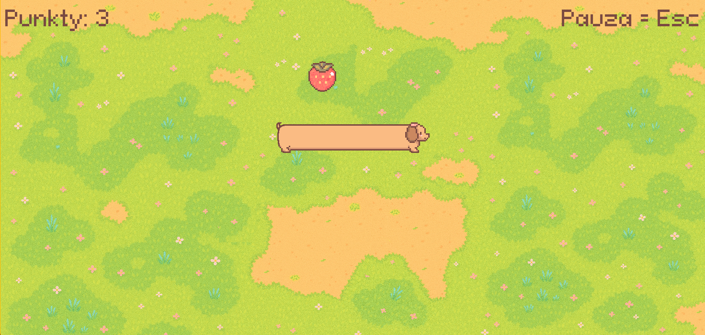
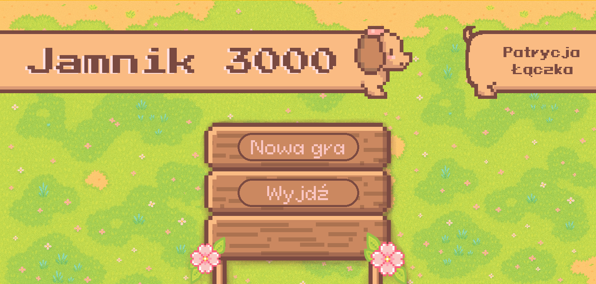

Pastelowa gra inspirowana klasycznym Snake'iem, w której sterujesz uroczym jamnikiem! 
Zbieraj owoce, unikaj kolizji i baw się dobrze przy relaksującej muzyce.

## Funkcje
- Urocza pastelowa oprawa pixel art
- Menu startowe z animowanymi przyciskami
- Efekty dźwiękowe i muzyka w tle
- Licznik punktów
- Ekran pauzy (`ESC`)
- Ekran przegranej z opcją powrotu
- Modularny kod w Pythonie (z użyciem `pygame`)

## Sterowanie
- `← ↑ ↓ →` / `WASD` – sterowanie jamnikiem  
- `ESC` – pauza  

## Jak uruchomić?
1. Zainstaluj pygame:
        pip install pygame
2. Uruchom:
        py main.py

## Struktura projektu
gra/
├── main.py
├── gra.py
├── gracz.py
├── owoc.py
├── plansza.py
├── przycisk.py
├── muzyka.py
├── assets/ # Grafiki, czcionki i dźwięki
└── README.md

## Zrzuty ekranu
  

## Autor
Projekt stworzony przez Patrycję Łączka jako projekt zaliczeniowy na studia.